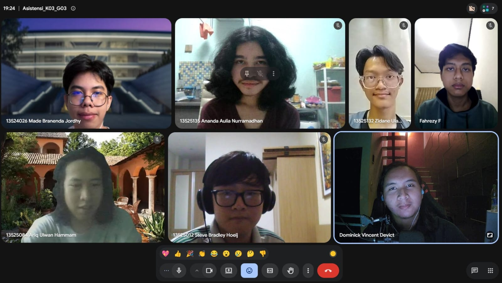

# Form Asistensi

## Tugas Besar IF2150 - Rekayasa Perangkat Lunak

| Informasi | Keterangan |
| --- | --- |
| **Hari** | *\[Hari\]* |
| **Tanggal** | *\[DD/MM/YYYY\]* |
| **Kelas** | *\[03\]* |
| **Nomor Kelompok** | *\[03\]*  |
| **Nama Kelompok** | *\[0x43\]*  |
| **Nama Perangkat Lunak** | *\[Commitment Issues\]*  |
| **Dokumen** | *\[K03_G03_Template1_TB.md\]*  |

### Anggota Kelompok

| NIM | Nama |
| --- | --- |
| *\[13525012\]* | *\[Steve Bradley Hoeij\]* |
| *\[13525072\]* | *\[Fahrezy Fitriansyah\]* |
| *\[13525084\]* | *\[Ariq Ulwan Hammam\]* |
| *\[13525132\]* | *\[Zidane Uland Fakhry\]* |
| *\[13525135\]* | *\[Ananda Aulia Nurramadhan\]* |

### Catatan

| Catatan |
| --- |
| 1. *\[Berikan catatan hasil asistensi\]*  |
| 2. ... |
| 3. ... |
| 4. ... |

**Notes for this section:**  
*Catatan dapat dituliskan dalam bentuk paragraf atau poin-poin, disesuaikan saja.* 

## Dokumentasi

<!--  -->

  

  <i>Gambar 1. Dokumentasi kegiatan asistensi.</i>

