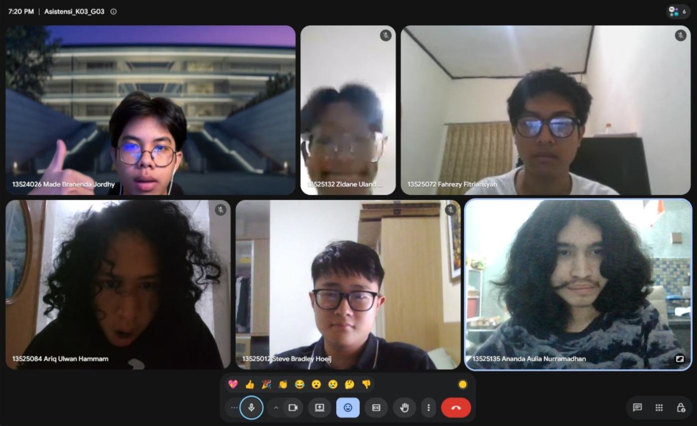

# Form Asistensi

## Tugas Besar IF2150 - Rekayasa Perangkat Lunak

| Informasi | Keterangan |
| --- | --- |
| **Hari** | Selasa |
| **Tanggal** | 15/09/2026 |
| **Kelas** | 03 |
| **Nomor Kelompok** | 03 |
| **Nama Kelompok** | 0x43 |
| **Nama Perangkat Lunak** | Commitment Issues |
| **Dokumen** | K03_G03_UC.md |

### Anggota Kelompok

| NIM | Nama |
| --- | --- |
| 13525012 | Steve Bradley Hoeij |
| 13525072 | Fahrezy Fitriansyah |
| 13525084 | Ariq Ulwan Hammam |
| 13525132 | Zidane Uland Fakhry |
| 13525135 | Ananda Aulia Nurramadhan |
| 10124063 | Dominick Vincent Devict |

### Catatan

| Catatan |
| --- |
| 1. Ruang lingkup UC02 (Mengevaluasi Tantangan) sebaiknya diperluas. |
| 2. Pertimbangkan *edge case* untuk setiap *use case*. |
| 3. *include* menandakan bahwa sesuatu wajib dieksekusi, sedangkan *exclude* menandakan bahwa sesuatu hanya dieksekusi dalam kondisi tertentu. |
| 4. Tambahkan *precondition* pada *use case* apabila diperlukan, misalnya *precondition* user sudah *login*, apabila mengimplementasikan sistem *login*. |

## Dokumentasi

<!--  -->

  

  <i>Gambar 1. Dokumentasi kegiatan asistensi.</i>

