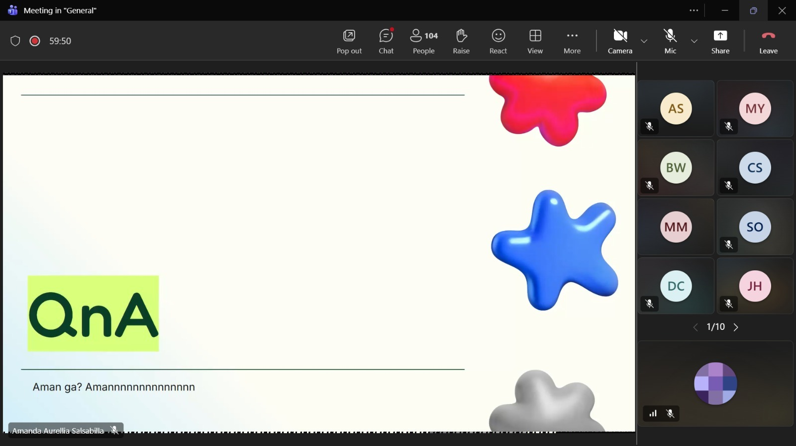

# Form Asistensi

## Tugas Besar IF2150 - Rekayasa Perangkat Lunak

| Informasi | Keterangan |
| --- | --- |
| **Hari** | Jumat |
| **Tanggal** | 18/09/2026 |
| **Kelas** | 03 |
| **Nomor Kelompok** | 03 |
| **Nama Kelompok** | 0x43 |
| **Nama Perangkat Lunak** | Commitment Issues |
| **Dokumen** | K03_G03_CD.md |

### Anggota Kelompok

| NIM | Nama |
| --- | --- |
| 13525012 | Steve Bradley Hoeij |
| 13525072 | Fahrezy Fitriansyah |
| 13525084 | Ariq Ulwan Hammam |
| 13525132 | Zidane Uland Fakhry |
| 13525135 | Ananda Aulia Nurramadhan |
| 10124063 | Dominick Vincent Devict |

### Catatan

| Catatan |
| --- |
| 1. - Aktor adalah pengguna yang berinteraksi langsung dengan perangkat lunak. Untuk interaksi dengan pihak ketiga, misalnya *payment gateway*, dianggap sebagai otorisasi dan tidak perlu dijadikan aktor. |
| 2. Pemrograman berorientasi objek tidak perlu diterapkan meskipun diagram kelas digunakan. Diagram kelas hanya digunakan untuk merepresentasikan hubungan antara entitas. |
| 3. Buat diagram kelas untuk setiap *use case* demi mempermudah identifikasi kelas. |
| 4. Rincikan kelas apa saja yang digunakan yang digunakan dalam setiap *use case*. |
| 5. Ketika membuat diagram kelas gabungan pastikan tidak ada hubungan yang bentrok. |
| 6. Kelas *entity* mencakup penyimpan data, kelas *boundary* mencakup komponen dalam antarmuka pengguna (*front end*), dan kelas *controller* mencakup pemroses data (*back end*). |

**Notes for this section:**  
*Catatan dapat dituliskan dalam bentuk paragraf atau poin-poin, disesuaikan saja.* 

## Dokumentasi

<!--  -->

  

  <i>Gambar 1. Dokumentasi kegiatan asistensi.</i>

