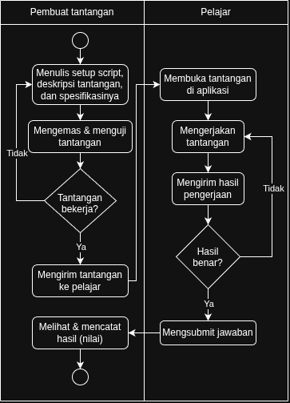
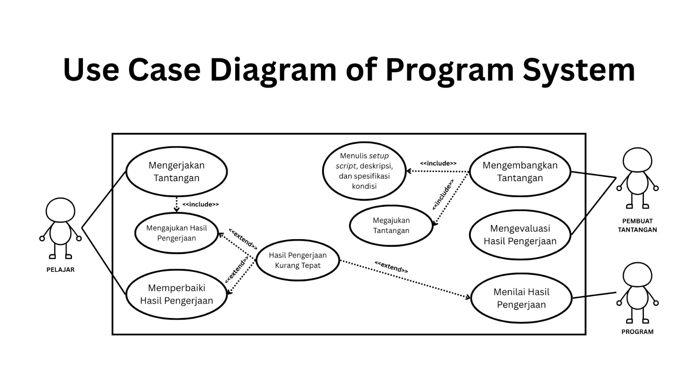
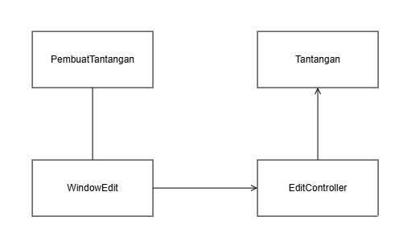
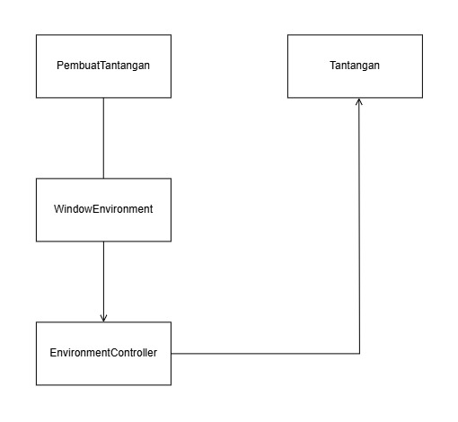
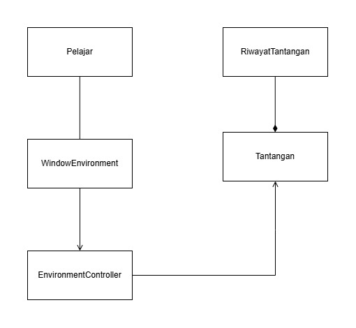
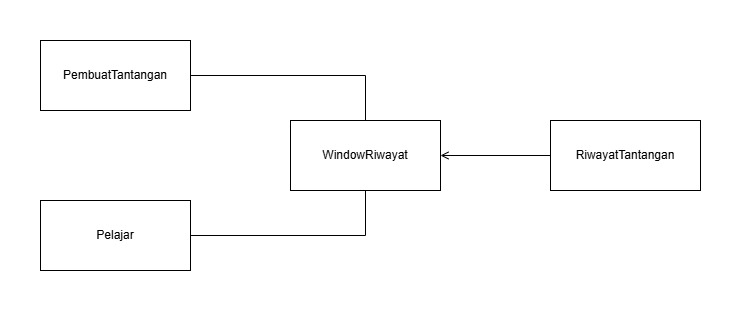
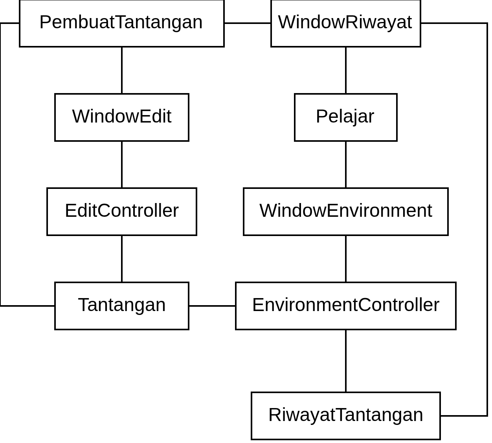

<h1>
IF2150 REKAYASA PERANGKAT LUNAK
 
TUGAS 5
 
SPESIFIKASI KEBUTUHAN PERANGKAT LUNAK (SKPL)
</h1>
 

## *Commitment Issues*

### Untuk: *Made Branenda Jordhy*

Dipersiapkan oleh:
| Informasi | Keterangan |
| --- | --- |
| Kelas | 03 |
| Kelompok | 0x43  |

| NIM | Nama |
|---|---|
| 13525012 | Steve Bradley Hoeij |
| 13525072 | Fahrezy Fitriansyah |
| 13525084 | Ariq Ulwan Hammam |
| 13525132 | Zidane Uland Fakhry |
| 13525135 | Ananda Aulia Nurramadhan |
| 10124063 | Dominick Vincent Devict |
---

## Daftar Perubahan

| Revisi | Deskripsi |
| :--- | :--- |
| *A* | *Deskripsikan perubahan yang dilakukan dari dokumen sebelumnya pada dokumen ini. Jika tidak terdapat perubahan, harap kosongkan tabel.* |
| *B* |  |
| *C* |  |
| ... |  |

 

# BAB 1: Pendahuluan

## 1.1 Tujuan Penulisan Dokumen
Tuliskan dengan ringkas tujuan dokumen SKPL ini dibuat dan siapa saja yang akan menggunakan dokumen ini.

## 1.2 Lingkup Masalah
Tuliskan dengan ringkas nama aplikasi dan deskripsi singkatnya. Bagian ini maksimal berisi satu paragraf, dapat diringkas dari BAB 1 *Analisis Permasalahan* pada dokumen *Topic Brainstorming*.

## 1.3 Definisi, Istilah, dan Singkatan
Semua definisi dan singkatan yang digunakan dalam dokumen ini beserta penjelasannya.

Tabel 1.3. Definisi Istilah dan Singkatan

| Singkatan, Akronim, atau Istilah | Penjelasan |
| :--- | :--- |
| *P/L* | *Singkatan dari Perangkat Lunak, yaitu aplikasi yang memberikan perintah kepada komputer untuk menjalankan tugas tertentu.* |
| *SKPL* | *Singkatan dari Spesifikasi Kebutuhan Perangkat Lunak, yaitu dokumen yang merangkum kriteria-kriteria yang diperlukan untuk membangun aplikasi menjalankan tugasnya.* |
| *KF* | *Singkatan dari Kebutuhan Fungsional.* |
| *KNF* | *Singkatan dari Kebutuhan Non-Fungsional.* |
| *UC* | *Singkatan dari Use Case.* |
| *EARS* | *Easy Approach to Requirements Syntax, yaitu pola penulisan kebutuhan agar konsisten dan mudah diuji.* |
| *...* | *...* |

## 1.4 Aturan Penomoran
Tuliskan aturan penomoran (ID) yang digunakan dalam dokumen ini. Gunakan pola ID yang **sama** dengan yang sudah dipakai pada dokumen-dokumen sebelumnya, jangan membuat pola baru di dokumen ini.

Tabel 1.4. Aturan Penomoran

| Hal/Bagian | Penomoran | Keterangan |
| :--- | :--- | :--- |
| *Kebutuhan Fungsional* | *KFXX* | |
| *Kebutuhan Non-Fungsional* | *KNFXX* | |
| *Aktor* | *AXX* | |
| *Use Case* | *UCXX* | |
| *Kelas* | *CXX* | |
| *...* | *...* |

## 1.5 Referensi
Dokumentasi P/L yang dirujuk oleh dokumen ini. Referensi dapat berupa buku, panduan, ataupun dokumentasi lain yang dipakai dalam pengembangan P/L ini.

## 1.6 Deskripsi Umum Dokumen (Ikhtisar)
Tuliskan sistematika pembahasan dokumen SKPL ini secara runut (misalnya: BAB 2 membahas deskripsi umum P/L, BAB 3 membahas kebutuhan fungsional dan non-fungsional, dst).

---

# BAB 2: Deskripsi Perangkat Lunak

## 2.1 Deskripsi Umum Sistem
Pembuat Tantangan serta Pelajar mengandalkan perangkat laptop dan koneksi internet untuk mengakses tantangan Git. Espektasi pembuat tantangan adalah sistem monitoring dalam rupa dashboard untuk mengelola repositori untuk merancang tantangan serta menguji sistem verifikasi, sedangkan ekspektasi Pelajar adalah lingkungan emulasi terminal yang intuitif, terutama bagi yang sudah familiar dengan perintah-perintah di terminal, realistis dengan pemanfaatannya di dunia nyata, dan menyeluruh sehingga memahami keseluruhan materi dengan baik.

Alur kerja sistem dibuat untuk proses bisnis akademik praktikum. Pembuat Tantangan dapat membuat repositori yang berisi masalah spesifik sehingga Pelajar dapat melakukan _clone_ repositori yang rusak, menganalisisnya, memperbaiki repositori tersebut menggunakan alat-alat yang telah diberikan, lalu memverifikasi hasil perbaikan tersebut. Melalui solusi ini, Pelajar diharapkan dapat terbiasa untuk menggunakan alat berstandar industri, Git, sementara pembuat tantangan terbantu dalam penilaian tugas pemrograman atau dalam hal ini pemahaman tentang Git.

<i>Gambar 1. Activity Diagram Proses Bisnis</i>

## 2.2 Deskripsi Umum Perangkat Lunak
Diisi dengan deskripsi umum perangkat lunak untuk mendukung proses bisnis yang telah diuraikan pada sub-bab sebelumnya. Uraian harus menunjukkan lingkup perangkat lunak, mencakup keterkaitan perangkat lunak dengan sistem lain di luar (misalnya *Payment Gateway* atau layanan pihak ketiga lain yang dipakai).

*Contoh narasi:* "*[Nama P/L]* merupakan aplikasi *[deskripsi singkat]* yang berinteraksi dengan *Payment Gateway (dummy)* untuk memproses otorisasi pembayaran. Sistem menerima input dari *Pelanggan* melalui antarmuka aplikasi dan mengirimkan permintaan transaksi ke *Payment Gateway* setiap kali pelanggan melakukan checkout."

## 2.3 Pengguna dan Kebutuhan Pengguna Perangkat Lunak
| Pengguna | Kebutuhan |
| :--- | :--- |
| *Pembuat Tantangan* | *Pengguna ini bertindak sebagai pihak yang sudah menguasai Git dan mendesain capaian pembelajaran, permasalahan, dan aturan validasi. Karakteristik dari pengguna ini adalah mengutamakan ketelitian dalam mendesain tantangan.* |
| *Pelajar* | *Pengguna ini bertindak sebagai pihak yang belum menguasai atau masih mempelajari Git dan sedang memecahkan masalah yang diberikan Pembuat Tantangan. Karakteristik dari pengguna ini adalah mengutamakan proses pemahaman.* |

## 2.4 Batasan Perangkat Lunak
Batasan yang harus dituliskan, di antaranya:
1. *P/L harus memakai file data/API dari sistem lain (sebutkan, misal Payment Gateway dummy).*
2. *P/L harus memakai format data yang sama dengan sistem lain.*
3. *P/L harus berfungsi pada platform tertentu (misal: web browser modern, atau desktop Windows dan Linux).*
4. *...*

## 2.5 Lingkungan Operasi Perangkat Lunak
Spesifikasi *operating system* atau lingkungan yang dibutuhkan P/L untuk beroperasi. Bagian ini digunakan untuk memastikan pengguna memiliki spesifikasi yang cukup untuk menjalankan P/L. Misalnya mencakup komponen server, client, OS, DBMS, tetapi tidak menutupi kemungkinan komponen lain.

| Komponen | Spesifikasi |
| :--- | :--- |
| *Server* | *[contoh: Node.js v20, dijalankan pada layanan cloud]* |
| *Client* | *[contoh: Web Browser modern (Chrome, Firefox terbaru)]* |
| *DBMS* | *[contoh: PostgreSQL 15]* |
| *OS* | *[contoh: Cross-platform (Windows/Linux/MacOS) melalui browser]* |
| *...* | *...* |

---

# BAB 3: Deskripsi Kebutuhan Perangkat Lunak

## 3.1 Kebutuhan Fungsional (KF)
Tabel 3.1. Kebutuhan Fungsional

| ID KF | ID Kebutuhan | Penjelasan |
| :--- | :--- | :--- |
| *KF01* | *R01* | *Ketika Pembuat Tantangan ingin mengunggah berkas setup script, deskripsi tantangan, dan aturan pengerjaan, sistem harus menyediakan fitur pengunggahan berkas awal* |
| *KF02* | *R02* | *Ketika Pembuat Tantangan ingin melakukan pengujian dan mempublikasikan tantangan, sistem harus menyediakan fitur dan lingkungan untuk uji coba serta fitur publikasi tantangan* |
| *KF03* | *R04* | *Ketika Pembuat Tantangan telah mengunggah berkas setup script, deskripsi tantangan, dan aturan pengerjaan, sistem harus mengeksekusi setup script untuk menyiapkan kondisi awal repositori tantangan* |
| *KF04* | *R05* | *Ketika Pelajar ingin memilih tantangan dan menjalankan perintah-perintah Git, sistem harus menampilkan katalog tantangan yang dapat dipilih Pelajar dan antarmuka CLI interaktif berbasis web untuk eksekusi perintah Git* |
| *KF05* | *R06* | *Ketika Pelajar ingin mengajukan (submit) pengerjaan repositori, sistem harus menyediakan fitur pengajuan, menerima hasil pengajuan, dan memverifikasi hasil yang diberikan* |
| *KF06* | *R08* | *Ketika Pelajar mengerjakan tantangan, sistem harus menyediakan lingkungan CLI serta memeriksa kondisi repositori Git Pelajar secara otomatis berdasarkan aturan yang telah dibuat* |
| *KF07* | *R09* | *Ketika Pelajar ingin mengetahui dan melihat letak kesalahan dalam pengerjaannya, sistem harus menampilkan umpan balik yang detail terkait hasil pengerjaan Pelajar* |
| *KF08* | *R10* | *Ketika Pelajar ingin melakukan perbaikan pada hasil pengerjaan repositorinya, sistem harus menyediakan fitur perbaikan pengerjaan dan menerima kembali pengajuan yang dikirim setelah Pelajar memperbaiki pengerjaannya* |
| *KF09* | *R11* | *Ketika Pelajar ingin melakukan perbaikan beberapa kali, sistem harus mampu menyimpan hasil perbaikan tanpa batasan jumlah dan mengorganisir penyimpanan agar tidak overload* |
| *KF10* | *R12* | *Ketika Pelajar telah mengajukan hasil perbaikan, sistem harus mampu menyimpan dan mencatat riwayat setiap percobaan (attempt) perbaikan pengerjaan Pelajar* |
| *KF11* | *R13* | *Ketika Pelajar telah selesai melakukan pengajuan, sistem harus menampilkan dashboard seluruh rekapitulasi nilai dan laporan hasil pengerjaan yang dpaat dilihat Pembuat Tantangan* |
| *KF12* | *R15* | *Ketika Pelajar ingin melihat nilai dan status kelulusan, sistem harus mampu menyimpan nilai dan status kelulusan pengerjaan Pelajar yang kemudian dapat ditampilkan kepada Pelajar* |

## 3.2 Kebutuhan Non-Fungsional (KNF)
Tabel 3.2. Kebutuhan Non-Fungsional

| ID KNF | ID Kebutuhan | Parameter | Deskripsi Kebutuhan |
| :--- | :--- | :--- | :--- |
| *KNF01* | *R03* | *Security* | *Bila setup script dieksekusi, maka sistem harus mengisolasinya dengan hak akses terbatas agar tidak dieksploitasi malware.* |
| *KNF02* | *R08* | *Reliability* | *Selama pemeriksaan repositori otomatis, sistem harus memproses validasi dengan tingkat ketersediaan tinggi tanpa kegagalan sistem.* |
| *KNF03* | *R12* | *Reliability* | *Sistem harus mampu mencatat dan menyimpan riwayat setiap percobaan dari seluruh Pelajar tanpa kehilangan data.* |
| *KNF04* | *R13* | *Ergonomy* | *Ketika Pembuat Tantangan membuka menu laporan, sistem harus memiliki tampilan antarmuka _dashboard_ yang intuitif agar memudahkan pembuat tantangan dalam membaca hasil Pelajar.* |
| *KNF05* | *R15* | *Compatibility* | *Sistem harus menyediakan fitur ekspor data nilai dan status kelulusan ke dalam format umum, seperti CSV.* |

---

# BAB 4: Pemodelan Use Case

## 4.1 Identifikasi Aktor
Salin ulang daftar aktor final dari BAB 3.1 dokumen *Use Case & Scenario Use Case* atau *Class Diagram*. Tambahkan ID Aktor mengikuti Aturan Penomoran pada 1.4.

| ID Aktor | Aktor | Deskripsi |
| :--- | :--- | :--- |
| A01 | *Pembuat Tantangan* | *Pengguna ini bertindak sebagai pihak yang sudah menguasai Git dan mendesain capaian pembelajaran, permasalahan, dan aturan validasi. Karakteristik dari pengguna ini adalah mengutamakan ketelitian dalam mendesain tantangan.* |
| A02 | *Pelajar* | *Pengguna ini bertindak sebagai pihak yang belum menguasai atau masih memPelajari Git dan sedang memecahkan masalah yang diberikan Pembuat Tantangan. Karakteristik dari pengguna ini adalah mengutamakan proses pemahaman.* |

## 4.2 Identifikasi Use Case
Salin ulang daftar Use Case versi terbaru dari BAB 3.2 dokumen *Class Diagram*, pastikan seluruh ID KF yang dirujuk sudah sesuai dengan tabel pada 3.1.

| ID UC | Nama Use Case | Deskripsi Singkat | Aktor | ID KF |
| :--- | :--- | :--- | :--- | :--- |
| *UC01* | *Mengembangkan Tantangan* | *Pembuat Tantangan mengupload berkas yang diperlukan dan menyimpan atau mengelola tantangan.* | *Pembuat Tantangan* | *KF01, KF03* |
| *UC02* | *Mengevaluasi Tantangan* | *Pembuat Tantangan menguji tantangan dan script verifikasi yang telah dibuat.* | *Pembuat Tantangan* | *KF02* |
| *UC03* | *Mengerjakan Tantangan* | *Pelajar mengerjakan tantangan yang tersedia.* | *Pelajar* | *KF04, KF05, KF06, KF07, KF08, KF09, KF10* |
| *UC04* | *Cek Riwayat* | *Pelajar atau Pembuat Tantangan mengecek riwayat dan penilaian dari pengerjaan yang telah dilakukan.* | *Pelajar dan Pembuat Tantangan* | *KF11, KF12* |

## 4.3 Use Case Diagram
Salin ulang Use Case Diagram dari BAB 3.3 dokumen *Use Case & Scenario Use Case* atau *Class Diagram* (gunakan versi paling akhir/terbaru apabila terdapat perubahan).

<i>Gambar 2. Use Case Diagram</i>

## 4.4 Skenario Use Case
Salin ulang skenario **setiap** use case (skenario normal dan alternatif) dari BAB 3.4 dokumen *Use Case & Scenario Use Case*, sesuaikan dengan daftar UC final pada 4.2. Jika use case melibatkan lebih dari satu aktor manusia yang benar-benar berinteraksi langsung (misalnya *Kasir* yang memverifikasi transaksi setelah *Pelanggan* membayar), tambahkan kolom aksi tersendiri untuk aktor tersebut di samping kolom "Reaksi Perangkat Lunak". Sistem eksternal otomatis seperti *payment gateway* **bukan aktor**, sehingga interaksinya cukup dituliskan sebagai bagian dari "Reaksi Perangkat Lunak", bukan kolom aktor terpisah.

### 4.4.1 Skenario UC01

**Nama Use Case:** *Mengembangkan tantangan*

**Skenario Normal**

| No | Aksi Aktor | Reaksi Perangkat Lunak |
| :--- | :--- | :--- |
| 1 | *Pembuat tantangan memilih menu pembuatan tantangan* | *Sistem menampilkan semua tantangan yang telah dibuat oleh pembuat tantangan* |
| 2 | *Pembuat tantangan memilih salah satu tantangan* | *Sistem mengarahkan pembuat tantangan ke halaman mengedit tantangan, dimana pembuat tantangan dapat menulis setup script serta mengubah deskripsi atau spesifikasi tantangan* |
| 3 | *Pembuat tantangan menyimpan perubahan tantangan* | *Sistem menyimpan semua perubahan yang dibuat oleh pembuat tantangan* |

**Skenario Alternatif 1: Menghapus Draf Tantangan**

| No | Aksi Aktor | Reaksi Perangkat Lunak |
| :--- | :--- | :--- |
| 1 | *Pembuat tantangan memilih menu pembuatan tantangan* | *Sistem menampilkan semua tantangan yang telah dibuat oleh pembuat tantangan* |
| 2 | *Pembuat tantangan memilih salah satu tantangan dan menghapusnya* | *Sistem menghapus data tantangan dari penyimpanan dan memperbaharui tantangan yang ditampilkan* |

### 4.4.2 Skenario UC02

**Nama Use Case:** *Mengevaluasi Tantangan*

**Skenario Normal**

| No | Aksi Aktor | Reaksi Perangkat Lunak |
| :--- | :--- | :--- |
| 1 | *Pembuat tantangan memilih menu pengujian tantangan* | *Sistem mengarahkan pembuat tantangan ke tampilan pengujian tantangan, dimana pembuat tantangan dapat mencoba mengerjakan tantangan seperti seorang pelajar* |
| 2 | *Pembuat tantangan mengirim command* | *Sistem memproses command dan melakukan perubahan yang sesuai ke repository* |
| 3 | *Pembuat tantangan mempublikasikan tantangan* | *Sistem memeriksa tidak ada tantangan dengan nama yang sama, lalu menambahkan tantangan ke bank tantangan pelajar* |

**Skenario Alternatif 1: Mengubah Tantangan yang Sudah Dipublikasikan**

| No | Aksi Aktor | Reaksi Perangkat Lunak |
| :--- | :--- | :--- |
| 1 | *Pembuat tantangan memilih menu pengujian tantangan* | *Sistem mengarahkan pembuat tantangan ke tampilan pengujian tantangan, dimana pembuat tantangan dapat mencoba mengerjakan tantangan seperti seorang pelajar* |
| 2 | *Pembuat tantangan mengirim command* | *Sistem memproses command dan melakukan perubahan ke repository simulasi* |2
| 3 | *Pembuat tantangan mempublikasikan tantangan* | *Sistem memperbaharui setup script, deskripsi, dan spesifikasi dari tantangan yang sedang dievaluasi* |

**Skenario Alternatif 2: Menghapus Tantangan yang Sudah Dipublikasikan**
| No | Aksi Aktor | Reaksi Perangkat Lunak |
| :--- | :--- | :--- |
| 1 | *Pembuat tantangan memilih menu pengujian tantangan* | *Sistem mengarahkan pembuat tantangan ke tampilan pengujian tantangan* |
| 2 | *Pembuat tantangan menghapus tantangan* | *Sistem menjadwalkan  penghapusan dan menghapus data tantangan dari bank tantangan setelah tidak ada pelajar yang sedang mengakses tantangan tersebut* |

### 4.4.3 Skenario UC03

**Nama Use Case:** *Mengerjakan Tantangan*

**Skenario Normal**

| No | Aksi Aktor | Reaksi Perangkat Lunak |
| :--- | :--- | :--- |
| 1 | *Pelajar memilih tantangan yang ingin dikerjakan* | *Sistem mengarahkan pelajar ke tampilan pengerjaan tantangan dan menjalankan setup script* |
| 2 | *Pelajar mengirim command yang tepat* | *Sistem menjalankan command dan memperbaharui repository* |
| 3 | *Pelajar mengirim command yang salah* | *Sistem menampilkan warning* |
| 4 | *Pelajar menekan tombol submit* | *Sistem memeriksa ketepatan jawaban pelajar. Jika semua ketentuan telah terpenuhi, sistem menunjukan pesan selesai mengerjakan soal dan menyimpan riwayat console ke riwayat pelajar. Jika belum, sistem menandakan ketentuan yang belum terpenuhi* |

**Skenario Alternatif 1: Pelajar Keluar di Tengah Pengerjaan**

| No | Aksi Aktor | Reaksi Perangkat Lunak |
| :--- | :--- | :--- |
| 1 | *Pelajar memilih tantangan yang ingin dikerjakan* | *Sistem mengarahkan pelajar ke tampilan pengerjaan tantangan dan menjalankan setup script* |
| 2 | *Pelajar mengirim command yang tepat* | *Sistem menjalankan command dan memperbaharui repository* |
| 3 | *Pelajar keluar dari tampilan pengerjaan tantangan* | *Sistem menunjukkan peringatan bahwa pekerjaan tidak akan tersimpan* |
| 4 | *Pelajar konfirmasi untuk keluar dari tampilan pengerjaan tantangan* | *Sistem mengarahkan pelajar ke tampilan pemilihan tantangan* |

**Skenario Alternatif 2: Pelajar Mengulang Pengerjaan**

| No | Aksi Aktor | Reaksi Perangkat Lunak |
| :--- | :--- | :--- |
| 1 | *Pelajar memilih tantangan yang ingin dikerjakan* | *Sistem mengarahkan pelajar ke tampilan pengerjaan tantangan dan menjalankan setup script* |
| 2 | *Pelajar mengirim command yang tepat* | *Sistem menjalankan command dan memperbaharui repository* |
| 3 | *Pelajar menekan tombol mengulang/restart* | *Sistem menampilkan window konfirmasi* |
| 4 | *Pelajar konfirmasi ingin mengulang* | *Sistem menjalankan setup script dan membersihkan console* |

### 4.4.4 Skenario UC04

**Nama Use Case:** *Cek Riwayat*

**Skenario Normal Pelajar**
| No | Aksi Aktor | Reaksi Perangkat Lunak |
| :--- | :--- | :--- |
| 1 | *Pelajar memilih menu riwayat pengerjaan*  | *Sistem mengarahkan pelajar ke tampilan riwayat pengerjaan, yang menampilkan semua tantangan yang sudah pernah dikerjakan* |
| 2 | *Pelajar memilih salah satu tantangan dari riwayat pengerjaan* | *Sistem menampilkan riwayat konsol dari saat pelajar menyelesaikan tantangan* |

**Skenario Alternatif 1: Pelajar mengulang tantangan**
| No | Aksi Aktor | Reaksi Perangkat Lunak |
| :--- | :--- | :--- |
| 1 | *Pelajar memilih menu riwayat pengerjaan*  | *Sistem mengarahkan pelajar ke tampilan riwayat pengerjaan, yang menampilkan semua tantangan yang sudah pernah dikerjakan* |
| 2 | *Pelajar memilih salah satu tantangan dari riwayat pengerjaan* | *Sistem menampilkan riwayat konsol dari saat pelajar menyelesaikan tantangan* |
| 3 | *Pelajar menekan tombol mengerjakan ulang* | *Sistem menampilkan window konfirmasi. Setelah konfirmasi, sistem mengarahkan pelajar ke tampilan pengerjaan tantangan dan menjalankan setup script* |

---

# BAB 5: Pemodelan Kelas

## 5.1 Identifikasi Kelas
Salin ulang seluruh kelas yang telah diidentifikasi dari BAB 4.1 dokumen *Class Diagram*.

| ID Kelas | Nama Kelas | Deskripsi Kelas | ID Use Case |
| :--- | :--- | :--- | :--- |
| *C01* | *Pelanggan* | *Menyimpan data akun pelanggan yang membuat pesanan.* | *UC01, UC05* |
| *C02* | *Pesanan* | *Menyimpan data pesanan beserta status pembayarannya.* | *UC01, UC03, UC05* |
| *C03* | *Keranjang* | *Menyimpan sementara item yang dipilih sebelum checkout.* | *UC01, UC02* |
| *...* | *...* | *...* | *...* |

## 5.2 Diagram Kelas per Use Case
Salin ulang diagram kelas untuk setiap use case dari BAB 4.2 dokumen *Class Diagram*, lengkap dengan tabel atribut dan metode/operasinya.

### 5.2.1 Use Case UC01

**Nama Use Case:** *Mengembangkan Tantangan*

#### Identifikasi Kelas

| ID Kelas | Nama Kelas | Deskripsi Kelas |
| :--- | :--- | :--- |
| *C01* | *PembuatTantangan* | *Pengguna yang merancang, menguji, dan merilis tantangan.* | *UC01, UC02, UC04* |
| *C03* | *Tantangan* | *Menyimpan informasi tentang tantangan seperti judul, deskripsi, dan arsip tantangan.* | *UC01, UC02, UC03* |
| *C04* | *WindowEdit* | *Antarmuka bagi Pembuat Tantangan untuk mengunggah tantangan.* | *UC01* |
| *C05* | *EditController* | *Mengontrol proses pengunggahan dan penyimpanan data tantangan baru ke sistem.* | *UC01* |

#### Diagram Kelas

<i>Gambar 3. Diagram Kelas Use Case UC01</i>

 

| ID Kelas | Nama Kelas | Atribut | Metode/Operasi |
| :--- | :--- | :--- | :--- |
| *C01* | *PembuatTantangan* | *idUser, nama* | *aksesMenuUnggah(), inputTantangan()* |
| *C03* | *Tantangan* | *idTantangan, judul, deskripsi, berkasTantangan* | *simpanTantangan()* |
| *C04* | *WindowEdit* | *formUnggah* | *tampilkanForm(), kirimBerkas()* |
| *C05* | *EditController* | *-* | *simpanTantangan()* |

### 5.2.2 Use Case UC02

**Nama Use Case:** *Mengevaluasi Tantangan*

#### Identifikasi Kelas

| ID Kelas | Nama Kelas | Deskripsi Kelas |
| :--- | :--- | :--- |
| *C01* | *PembuatTantangan* | *Pengguna yang merancang, menguji, dan merilis tantangan.* | *UC01, UC02, UC04* |
| *C03* | *Tantangan* | *Menyimpan informasi tentang tantangan seperti judul, deskripsi, dan arsip tantangan.* | *UC01, UC02, UC03* |
| *C06* | *WindowEnvironment* | *Antarmuka pengerjaan tantangan bagi Pelajar serta pengujian tantangan bagi PembuatTantangan.* | *UC02, UC03* |
| *C07* | *EnvironmentController* | *Mengontrol eksekusi perintah, pengujian, dan pemrosesan solusi.* | *UC02, UC03* |

#### Diagram Kelas

<i>Gambar 4. Diagram Kelas Use Case UC02</i>

 

| ID Kelas | Nama Kelas | Atribut | Metode/Operasi |
| :--- | :--- | :--- | :--- |
| *C01* | *PembuatTantangan* | *idUser, nama* | *ujiTantangan()* |
| *C03* | *Tantangan* | *idTantangan, berkasTantangan* | *muatSetupScript()* |
| *C06* | *WindowEnvironment* | *terminalInput* | *tampilkanTerminalUji()* |
| *C07* | *EnvironmentController* | *-* | *eksekusiCommandUji()* |

### 5.2.3 Use Case UC03

**Nama Use Case:** *Mengerjakan Tantangan*

#### Identifikasi Kelas

| ID Kelas | Nama Kelas | Deskripsi Kelas |
| :--- | :--- | :--- |
| *C02* | *Pelajar* | *Pengguna yang memilih, mengerjakan, dan melihat riwayat pengerjaan.* | *UC03, UC04* |
| *C03* | *Tantangan* | *Menyimpan informasi tentang tantangan seperti judul, deskripsi, dan arsip tantangan.* | *UC01, UC02, UC03* |
| *C06* | *WindowEnvironment* | *Antarmuka pengerjaan tantangan bagi Pelajar serta pengujian tantangan bagi PembuatTantangan.* | *UC02, UC03* |
| *C07* | *EnvironmentController* | *Mengontrol eksekusi perintah, pengujian, dan pemrosesan solusi.* | *UC02, UC03* |
| *C09* | *RiwayatTantangan* | *Menyimpan catatan hasil pengerjaan, nilai, dan riwayat pengerjaan.* | *UC03, UC04* |

#### Diagram Kelas

<i>Gambar 5. Diagram Kelas Use Case UC03</i>

 

| ID Kelas | Nama Kelas | Atribut | Metode/Operasi |
| :--- | :--- | :--- | :--- |
| *C02* | *Pelajar* | *isUser, nama.* | *pilihTantangan(), kirimSolusi()* |
| *C03* | *Tantangan* | *idTantangan, berkasTantangan* | *muatTantangan()* |
| *C06* | *WindowEnvironment* | *terminalInput, tombolAksi* | *tampilkanTerminalSimulasi(), kirim(), reset()* |
| *C07* | *EnvironmentController* | *-* | *prosesCommand(), validasiSolusi(), simpanSolusi()* |
| *C09* | *RiwayatTantangan* | *idRiwayat, statusPengerjaan, skor* | *simpanPekerjaan()* |

### 5.2.4 Use Case UC04

**Nama Use Case:** *Cek Riwayat*

#### Identifikasi Kelas

| ID Kelas | Nama Kelas | Deskripsi Kelas |
| :--- | :--- | :--- |
| *C01* | *PembuatTantangan* | *Pengguna yang merancang, menguji, dan merilis tantangan.* | *UC01, UC02, UC04* |
| *C02* | *Pelajar* | *Pengguna yang memilih, mengerjakan, dan melihat riwayat pengerjaan.* | *UC03, UC04* |
| *C08* | *WindowRiwayat* | *Antarmuka untuk menampilkan rekapitulasi nilai dan riwayat pengerjaan.* | *UC04* |
| *C09* | *RiwayatTantangan* | *Menyimpan catatan hasil pengerjaan, nilai, dan riwayat pengerjaan.* | *UC03, UC04* |

#### Diagram Kelas

<i>Gambar 6. Diagram Kelas Use Case UC04</i>

 

| ID Kelas | Nama Kelas | Atribut | Metode/Operasi |
| :--- | :--- | :--- | :--- |
| *C01* | *PembuatTantangan* | *idUser, nama* | *lihatRekapitulasiNilai()* |
| *C02* | *Pelajar* | *idUser, nama* | *aksesRiwayat(), ulangiTantangan()* |
| *C08* | *WindowRiwayat* | *daftarRiwayatTampilan* | *tampilkanDaftarRiwayat(), tampilkanDetail()* |
| *C09* | *RiwayatTantangan* | *idRiwayat, skor, statusPengerjaan* | *ambilDataRiwayat()* |

## 5.3 Diagram Kelas Keseluruhan
Gabungkan seluruh kelas dan hubungan antarkelas dari BAB 4.3 dokumen *Class Diagram* menjadi satu diagram kelas keseluruhan. Pastikan tidak ada kelas yang terduplikasi atau tertinggal.

<i>Gambar 7. Diagram Kelas Keseluruhan</i>

| ID Kelas | Nama Kelas | Atribut | Metode/Operasi |
| :--- | :--- | :--- | :--- |
| *C01* | *PembuatTantangan* | *idUser, nama* | *aksesMenuUnggah(), inputTantangan(), ujiTantangan(), lihatRekapitulasiNilai()* |
| *C02* | *Pelajar* | *idUser, nama* | *pilihTantangan(), kirimSolusi(), aksesRiwayat(), ulangiTantangan()* |
| *C03* | *Tantangan* | *idTantangan, judul, deskripsi, berkasTantangan* | *simpanTantangan(), muatSetupScript(), muatTantangan()* |
| *C04* | *WindowEdit* | *formUnggah* | *tampilkanForm(), kirimBerkas()* |
| *C05* | *EditController* | *-* | *simpanTantangan()* |
| *C06* | *WindowEnvironment* | *terminalInput, tombolAksi* | *tampilkanTerminalUji(), tampilkanTerminalSimulasi(), kirim(), reset()* |
| *C07* | *EnvironmentController* | *-* | *eksekusiCommandUji(), prosesCommand(), validasiSolusi(), simpanSolusi()* |
| *C08* | *WindowRiwayat* | *daftarRiwayatTampilan* | *tampilkanDaftarRiwayat(), tampilkanDetail()* |
| *C09* | *RiwayatTantangan* | *idRiwayat, statusPengerjaan, skor* | *simpanPekerjaan(), ambilDataRiwayat()* |

---

# BAB 6: Traceability
Salin ulang tabel Traceability dari BAB 5 dokumen *Class Diagram*, cocokkan setiap Kebutuhan Fungsional, Use Case, dan Kelas yang saling terkait.

| ID Kelas | ID Use Case | ID KF |
| :--- | :--- | :--- |
| *C01* | *UC01, UC02, UC04* | *KF01, KF02, KF11* |
| *C02* | *UC03, UC04* | *KF04, KF05, KF06, KF07, KF08, KF09, KF10, KF12* |
| *C03* | *UC01, UC02, UC03* | *KF01, KF02, KF03, KF06* |
| *C04* | *UC01* | *KF01* |
| *C05* | *UC01* | *KF01, KF03* |
| *C06* | *UC02, UC03* | *KF02, KF04, KF06, KF07, KF08* |
| *C07* | *UC02, UC03* | *KF02, KF03, KF05, KF06, KF07, KF08, KF09, KF10* |
| *C08* | *UC04* | *KF11, KF12* |
| *C09* | *UC03, UC04* | *KF09, KF10, KF11, KF12* |

---

# Referensi
- Diagram UML: [https://www.drawio.com/](https://www.drawio.com/), [https://staruml.io/](https://staruml.io/)
