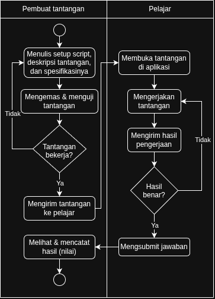
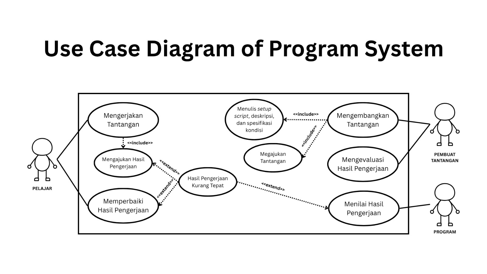
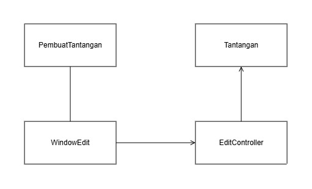
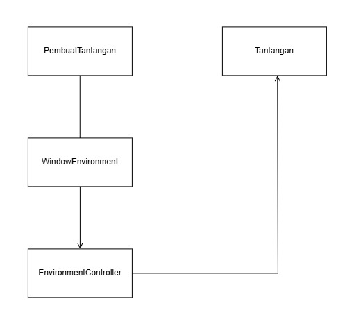
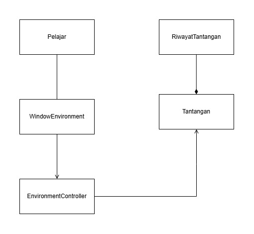
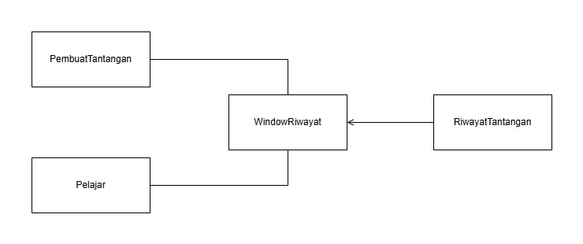
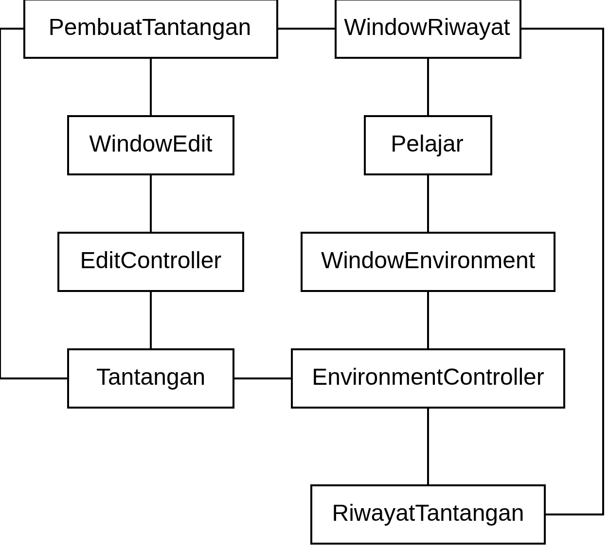

<h1>
IF2150 REKAYASA PERANGKAT LUNAK
 
TUGAS 5
 
SPESIFIKASI KEBUTUHAN PERANGKAT LUNAK (SKPL)
</h1>
 

## *Commitment Issues*

### Untuk: *Made Branenda Jordhy*

Dipersiapkan oleh:
| Informasi | Keterangan |
| --- | --- |
| Kelas | 03 |
| Kelompok | 0x43  |

| NIM | Nama |
|---|---|
| 13525012 | Steve Bradley Hoeij |
| 13525072 | Fahrezy Fitriansyah |
| 13525084 | Ariq Ulwan Hammam |
| 13525132 | Zidane Uland Fakhry |
| 13525135 | Ananda Aulia Nurramadhan |
| 10124063 | Dominick Vincent Devict |
---

## Daftar Perubahan

| Revisi | Deskripsi |
| :--- | :--- |
| - | - |

 

# BAB 1: Pendahuluan

## 1.1 Tujuan Penulisan Dokumen
Dokumen SKPL ini dibuat sebagai titik acuan atau panduan selama proses pengembangan perangkat lunak _Commitment Issues_. Dokumen ini diperuntukan para pengembang perangkat lunak _Commitment Issues_ dan semua guru, dosen, atau pengajar lainnya yang ingin menggunakan perangkat lunak _Commitment Issues_ dalam proses pengajaran Git.

## 1.2 Lingkup Masalah
Git adalah sistem kendali versi yang memungkinkan penggunanya untuk melacak perubahan pada kode dan mengatur proyek menggunakan perintah-perintah sederhana. Menurut Stack Overflow Developer Survey pada 2022 yang mengakumulasi jawaban dari 70.000 developer, 93,87% responden mengadopsi Git sebagai sistem kendali versi. _Commitment Issues_ bertujuan untuk menyediakan sarana pembelajaran interaktif yang menyimulasikan penerapan Git dalam suatu proyek yang realistis, sehingga memberikan pengalaman belajar yang lebih relevan dan mudah diterapkan bagi pelajar. Perangkat lunak ini akan berfokus untuk menguji pelajar dalam menghadapi skenario-skenario yang sering ditemukan saat menggunakan Git, contohnya penanganan konflik.

## 1.3 Definisi, Istilah, dan Singkatan
Tabel 1.3. Definisi Istilah dan Singkatan

| Singkatan, Akronim, atau Istilah | Penjelasan |
| :--- | :--- |
| *P/L* | *Singkatan dari Perangkat Lunak, yaitu aplikasi yang memberikan perintah kepada komputer untuk menjalankan tugas tertentu.* |
| *SKPL* | *Singkatan dari Spesifikasi Kebutuhan Perangkat Lunak, yaitu dokumen yang merangkum kriteria-kriteria yang diperlukan untuk membangun aplikasi menjalankan tugasnya.* |
| *KF* | *Singkatan dari Kebutuhan Fungsional.* |
| *KNF* | *Singkatan dari Kebutuhan Non-Fungsional.* |
| *UC* | *Singkatan dari Use Case.* |
| *EARS* | *Easy Approach to Requirements Syntax, yaitu pola penulisan kebutuhan agar konsisten dan mudah diuji.* |

## 1.4 Aturan Penomoran
Aturan penomoran (ID) yang digunakan dalam dokumen ini adalah sebagai berikut.

Tabel 1.4. Aturan Penomoran

| Hal/Bagian | Penomoran | Keterangan |
| :--- | :--- | :--- |
| *Kebutuhan Fungsional* | *KFXX* | KF merupakan singkatan dari kebutuhan fungsional. XX merupakan nomor urut kebutuhan fungsional, dimulai dari 01. Contoh: KF01, KF99, dan sebagainya. |
| *Kebutuhan Non-Fungsional* | *KNFXX* | KNF merupakan singkatan dari kebutuhan non-fungsional. XX merupakan nomor urut kebutuhan non-fungsional, dimulai dari 01. Contoh: KF01, KF99, dan sebagainya. |
| *Aktor* | *AXX* | A merupakan singkatan dari aktor. XX merupakan nomor urut aktor yang teridentifikasi di dalam sistem, dimulai dari 01. Contoh: A01, A02, dan sebagainya. |
| *Use Case* | *UCXX* | UC merupakan singkatan dari use case. XX merupakan nomor urut use case yang teridentifikasi di dalam sistem, dimulai dari 01. Contoh: UC01, UC02, dan sebagainya. |
| *Kelas* | *CXX* | K merupakan singkatan dari kelas. XX merupakan nomor urut kelas yang teridentifikasi di dalam sistem, dimulai dari 01. Contoh: C01, C02, dan sebagainya. |

## 1.5 Referensi
- Chacon, S. & Straub, B. (2014). Pro Git (edisi ke-2). Apress. Tersedia di: [https://git-scm.com/book/en/v2](https://git-scm.com/book/en/v2)
- Git Practice. (t.thn.). Git Practice: Interactive Git Learning. Diakses pada 30 Agustus 2026, dari [https://git-practice.com](https://git-practice.com)
- Peter C. (t.thn.). Learn Git Branching. Diambil kembali dari [https://learngitbranching.js.org](https://learngitbranching.js.org)

## 1.6 Deskripsi Umum Dokumen (Ikhtisar)
Dokumen ini terdiri atas:
- Bab 1 yang berisi pendahuluan.
- Bab 2 yang berisi pembahasan terkait P/L, mencakup deskripsi sistem dan P/L, serta batasan dan lingkungan operasi P/L.
- Bab 3 yang berisi perincian kebutuhan fungsional dan non-fungsional P/L.
- Bab 4 yang berisi perincian skenario normal dan alternatif (apabila ada) setiap _use case_ P/L yang kemudian dimodelkan menjadi diagram _use case_.
- Bab 5 yang berisi pemodelan sistem P/L menggunakan kelas, representasi entitas dalam sistem, dalam setiap _use case_ yang kemudian digeneralisasi dalam satu diagram kelas.
- Bab 6 yang berisi pemodelan hubungan antara setiap kelas dengan _use case_ dan kebutuhan fungsional P/L.

---

# BAB 2: Deskripsi Perangkat Lunak

## 2.1 Deskripsi Umum Sistem
Pembuat Tantangan serta Pelajar mengandalkan perangkat laptop dan koneksi internet untuk mengakses tantangan Git. Espektasi pembuat tantangan adalah sistem monitoring dalam rupa dashboard untuk mengelola repositori untuk merancang tantangan serta menguji sistem verifikasi, sedangkan ekspektasi Pelajar adalah lingkungan emulasi terminal yang intuitif, terutama bagi yang sudah familiar dengan perintah-perintah di terminal, realistis dengan pemanfaatannya di dunia nyata, dan menyeluruh sehingga memahami keseluruhan materi dengan baik.

Alur kerja sistem dibuat untuk proses bisnis akademik praktikum. Pembuat Tantangan dapat membuat repositori yang berisi masalah spesifik sehingga Pelajar dapat melakukan _clone_ repositori yang rusak, menganalisisnya, memperbaiki repositori tersebut menggunakan alat-alat yang telah diberikan, lalu memverifikasi hasil perbaikan tersebut. Melalui solusi ini, Pelajar diharapkan dapat terbiasa untuk menggunakan alat berstandar industri, Git, sementara pembuat tantangan terbantu dalam penilaian tugas pemrograman atau dalam hal ini pemahaman tentang Git.

<i>Gambar 1. Activity Diagram Proses Bisnis</i>

## 2.2 Deskripsi Umum Perangkat Lunak
_Commitment Issues_ merupakan aplikasi pembelajaran Git dimana pelajar dapat mengerjakan berbagai tantangan yang didesain untuk menyimulasikan skenario-skenario realistis yang mungkin ditemukan ketika menggunakan Git. Untuk menyimpan data Pelajar, seperti biodata Pelajar dan riwayat tantangan-tantangan yang sudah pernah diselesaikan atau sedang dikerjakan, sistem akan berinteraksi dengan suatu **Database**. Sistem akan mengirimkan perubahan riwayat pelajar ke **Database** setiap kali Pelajar menyelesaikan suatu tantangan atau keluar dari tampilan pengerjaan tantangan. **Database** juga akan menyimpan data para Pembuat Tantangan, yaitu biodata pengguna dan informasi dari tantangan-tantangan yang pernah dibuat oleh Pembuat Tantangan tersebut. 

Dalam menginisiasi sebuah repository untuk tantangan, sistem akan mengextract sebuah zip setup yang telah dibuat oleh Pembuat Tantangan. File zip tersebut berisikan data repositori Git untuk tantangan tersebut, beserta script-script untuk menginisiasi repository tantangan, mengulang tantangan, dan memverifikasi jawaban. Repository tantangan disimpan pada environment sandbox yang berada di server sistem.

Saat seorang Pelajar mengerjakan suatu tantangan atau seorang Pembuat Tantangan sedang mengevaluasi suatu tantangan, Pelajar/Pembuat Tantangan akan mengirimkan command-command Git melalui suatu _Command Line Interface_. Command-command yang dijalankan oleh Pengguna lewat CLI tersebut akan diterima dan dijalankan oleh server.

## 2.3 Pengguna dan Kebutuhan Pengguna Perangkat Lunak
Tabel 2.1. Pengguna dan Kebutuhan Pengguna

| Pengguna | Kebutuhan |
| :--- | :--- |
| *Pembuat Tantangan* | *Pengguna ini bertindak sebagai pihak yang sudah menguasai Git dan mendesain capaian pembelajaran, permasalahan, dan aturan validasi. Karakteristik dari pengguna ini adalah mengutamakan ketelitian dalam mendesain tantangan.* |
| *Pelajar* | *Pengguna ini bertindak sebagai pihak yang belum menguasai atau masih mempelajari Git dan sedang memecahkan masalah yang diberikan Pembuat Tantangan. Karakteristik dari pengguna ini adalah mengutamakan proses pemahaman.* |

## 2.4 Batasan Perangkat Lunak
1. P/L harus menyimpan data informasi pengguna (Pelajar ataupun Pembuat Tantangan) menggunakan Database eksternal.
2. P/L harus berfungsi pada platform web browser modern.
3. Setiap repository tantangan oleh sistem hanya dapat diakses dan digunakan oleh satu Pengguna.
4. Repository yang disimulasikan tidak tersimpan secara lokal pada perangkat pengguna.

## 2.5 Lingkungan Operasi Perangkat Lunak
Spesifikasi dependensi untuk P/L ini.

Tabel 2.2. Lingkungan Operasi P/L

| Komponen | Spesifikasi |
| :--- | :--- |
| *OS Server* | NixOS 25.06 |
| *Server web* | Nginx |
| *Runtime & Backend* | NodeJS 24 LTS |
| *DBMS* | PostgreSQL 18 |
| *Git* | Git 2.54.0 |
| *Browser* | Mozilla Firefox 150+ |
| *OS* | Cross-platform (asalkan mendukung web-browser yang didukung) |

---

# BAB 3: Deskripsi Kebutuhan Perangkat Lunak

## 3.1 Kebutuhan Fungsional (KF)
Tabel 3.1. Kebutuhan Fungsional

| ID KF | ID Kebutuhan | Penjelasan |
| :--- | :--- | :--- |
| *KF01* | *R01* | *Ketika Pembuat Tantangan ingin mengunggah berkas setup script, deskripsi tantangan, dan aturan pengerjaan, sistem harus menyediakan fitur pengunggahan berkas awal* |
| *KF02* | *R02* | *Ketika Pembuat Tantangan ingin melakukan pengujian dan mempublikasikan tantangan, sistem harus menyediakan fitur dan lingkungan untuk uji coba serta fitur publikasi tantangan* |
| *KF03* | *R04* | *Ketika Pembuat Tantangan telah mengunggah berkas setup script, deskripsi tantangan, dan aturan pengerjaan, sistem harus mengeksekusi setup script untuk menyiapkan kondisi awal repositori tantangan* |
| *KF04* | *R05* | *Ketika Pelajar ingin memilih tantangan dan menjalankan perintah-perintah Git, sistem harus menampilkan katalog tantangan yang dapat dipilih Pelajar dan antarmuka CLI interaktif berbasis web untuk eksekusi perintah Git* |
| *KF05* | *R06* | *Ketika Pelajar ingin mengajukan (submit) pengerjaan repositori, sistem harus menyediakan fitur pengajuan, menerima hasil pengajuan, dan memverifikasi hasil yang diberikan* |
| *KF06* | *R08* | *Ketika Pelajar mengerjakan tantangan, sistem harus menyediakan lingkungan CLI serta memeriksa kondisi repositori Git Pelajar secara otomatis berdasarkan aturan yang telah dibuat* |
| *KF07* | *R09* | *Ketika Pelajar ingin mengetahui dan melihat letak kesalahan dalam pengerjaannya, sistem harus menampilkan umpan balik yang detail terkait hasil pengerjaan Pelajar* |
| *KF08* | *R10* | *Ketika Pelajar ingin melakukan perbaikan pada hasil pengerjaan repositorinya, sistem harus menyediakan fitur perbaikan pengerjaan dan menerima kembali pengajuan yang dikirim setelah Pelajar memperbaiki pengerjaannya* |
| *KF09* | *R11* | *Ketika Pelajar ingin melakukan perbaikan beberapa kali, sistem harus mampu menyimpan hasil perbaikan tanpa batasan jumlah dan mengorganisir penyimpanan agar tidak overload* |
| *KF10* | *R12* | *Ketika Pelajar telah mengajukan hasil perbaikan, sistem harus mampu menyimpan dan mencatat riwayat setiap percobaan (attempt) perbaikan pengerjaan Pelajar* |
| *KF11* | *R13* | *Ketika Pelajar telah selesai melakukan pengajuan, sistem harus menampilkan dashboard seluruh rekapitulasi nilai dan laporan hasil pengerjaan yang dpaat dilihat Pembuat Tantangan* |
| *KF12* | *R15* | *Ketika Pelajar ingin melihat nilai dan status kelulusan, sistem harus mampu menyimpan nilai dan status kelulusan pengerjaan Pelajar yang kemudian dapat ditampilkan kepada Pelajar* |

## 3.2 Kebutuhan Non-Fungsional (KNF)
Tabel 3.2. Kebutuhan Non-Fungsional

| ID KNF | ID Kebutuhan | Parameter | Deskripsi Kebutuhan |
| :--- | :--- | :--- | :--- |
| *KNF01* | *R03* | *Security* | *Bila setup script dieksekusi, maka sistem harus mengisolasinya dengan hak akses terbatas agar tidak dieksploitasi malware.* |
| *KNF02* | *R08* | *Reliability* | *Selama pemeriksaan repositori otomatis, sistem harus memproses validasi dengan tingkat ketersediaan tinggi tanpa kegagalan sistem.* |
| *KNF03* | *R12* | *Reliability* | *Sistem harus mampu mencatat dan menyimpan riwayat setiap percobaan dari seluruh Pelajar tanpa kehilangan data.* |
| *KNF04* | *R13* | *Ergonomy* | *Ketika Pembuat Tantangan membuka menu laporan, sistem harus memiliki tampilan antarmuka _dashboard_ yang intuitif agar memudahkan pembuat tantangan dalam membaca hasil Pelajar.* |
| *KNF05* | *R15* | *Compatibility* | *Sistem harus menyediakan fitur ekspor data nilai dan status kelulusan ke dalam format umum, seperti CSV.* |

---

# BAB 4: Pemodelan Use Case

## 4.1 Identifikasi Aktor
Tabel 4.1. Identifikasi Aktor

| ID Aktor | Aktor | Deskripsi |
| :--- | :--- | :--- |
| A01 | *Pembuat Tantangan* | *Pengguna ini bertindak sebagai pihak yang sudah menguasai Git dan mendesain capaian pembelajaran, permasalahan, dan aturan validasi. Karakteristik dari pengguna ini adalah mengutamakan ketelitian dalam mendesain tantangan.* |
| A02 | *Pelajar* | *Pengguna ini bertindak sebagai pihak yang belum menguasai atau masih memPelajari Git dan sedang memecahkan masalah yang diberikan Pembuat Tantangan. Karakteristik dari pengguna ini adalah mengutamakan proses pemahaman.* |

## 4.2 Identifikasi Use Case
Tabel 4.2. Identifikasi Use Case

| ID UC | Nama Use Case | Deskripsi Singkat | Aktor | ID KF |
| :--- | :--- | :--- | :--- | :--- |
| *UC01* | *Mengembangkan Tantangan* | *Pembuat Tantangan mengupload berkas yang diperlukan dan menyimpan atau mengelola tantangan.* | *Pembuat Tantangan* | *KF01, KF03* |
| *UC02* | *Mengevaluasi Tantangan* | *Pembuat Tantangan menguji tantangan dan script verifikasi yang telah dibuat.* | *Pembuat Tantangan* | *KF02* |
| *UC03* | *Mengerjakan Tantangan* | *Pelajar mengerjakan tantangan yang tersedia.* | *Pelajar* | *KF04, KF05, KF06, KF07, KF08, KF09, KF10* |
| *UC04* | *Cek Riwayat* | *Pelajar atau Pembuat Tantangan mengecek riwayat dan penilaian dari pengerjaan yang telah dilakukan.* | *Pelajar dan Pembuat Tantangan* | *KF11, KF12* |

## 4.3 Use Case Diagram

<i>Gambar 2. Use Case Diagram</i>

## 4.4 Skenario Use Case

### 4.4.1 Skenario UC01

**Nama Use Case:** *Mengembangkan tantangan*

**Skenario Normal**

| No | Aksi Aktor | Reaksi Perangkat Lunak |
| :--- | :--- | :--- |
| 1 | *Pembuat tantangan memilih menu pembuatan tantangan* | *Sistem menampilkan semua tantangan yang telah dibuat oleh pembuat tantangan* |
| 2 | *Pembuat tantangan memilih salah satu tantangan* | *Sistem mengarahkan pembuat tantangan ke halaman mengedit tantangan, dimana pembuat tantangan dapat mengunggah berkas tantangan serta mengisi deskripsi atau spesifikasi tantangan* |
| 3 | *Pembuat tantangan menyimpan perubahan tantangan* | *Sistem menyimpan semua perubahan yang dibuat oleh pembuat tantangan* |

**Skenario Alternatif 1: Berkas Tantangan Gagal Diproses**

| No | Aksi Aktor | Reaksi Perangkat Lunak |
| :--- | :--- | :--- |
| 1 | *Pembuat tantangan mengunggah berkas tantangan yang tidak valid* | *Sistem mendeteksi kegagalan parsing struktur berkas dan menampilkan pesan kesalahan* |
| 2 | *Pembuat tantangan memperbaiki dengan mengunggah ulang berkas* | *Sistem berhasil memvalidasi struktur berkas dan memperbarui repositori tantangan* |

### 4.4.2 Skenario UC02

**Nama Use Case:** *Mengevaluasi Tantangan*

**Skenario Normal**

| No | Aksi Aktor | Reaksi Perangkat Lunak |
| :--- | :--- | :--- |
| 1 | *Pembuat tantangan memilih menu pengujian tantangan* | *Sistem mengarahkan pembuat tantangan ke tampilan pengujian tantangan, dimana pembuat tantangan dapat mencoba mengerjakan tantangan seperti seorang pelajar* |
| 2 | *Pembuat tantangan mengirim command* | *Sistem memproses command dan melakukan perubahan yang sesuai ke repository* |
| 3 | *Pembuat tantangan mempublikasikan tantangan* | *Sistem memeriksa tidak ada tantangan dengan nama yang sama, lalu menambahkan tantangan ke bank tantangan pelajar* |

**Skenario Alternatif 1: Mengubah Tantangan yang Sudah Dipublikasikan**

| No | Aksi Aktor | Reaksi Perangkat Lunak |
| :--- | :--- | :--- |
| 1 | *Pembuat tantangan memilih menu pengujian tantangan* | *Sistem mengarahkan pembuat tantangan ke tampilan pengujian tantangan, dimana pembuat tantangan dapat mencoba mengerjakan tantangan seperti seorang pelajar* |
| 2 | *Pembuat tantangan mengirim command* | *Sistem memproses command dan melakukan perubahan ke repository simulasi* |2
| 3 | *Pembuat tantangan mempublikasikan tantangan* | *Sistem memperbaharui berkas tantangan, deskripsi, dan spesifikasi dari tantangan yang sedang dievaluasi* |

**Skenario Alternatif 2: Menghapus Tantangan yang Sudah Dipublikasikan**

| No | Aksi Aktor | Reaksi Perangkat Lunak |
| :--- | :--- | :--- |
| 1 | *Pembuat tantangan memilih menu pengujian tantangan* | *Sistem mengarahkan pembuat tantangan ke tampilan pengujian tantangan* |
| 2 | *Pembuat tantangan menghapus tantangan* | *Sistem menjadwalkan  penghapusan dan menghapus data tantangan dari bank tantangan setelah tidak ada pelajar yang sedang mengakses tantangan tersebut* |

### 4.4.3 Skenario UC03

**Nama Use Case:** *Mengerjakan Tantangan*

**Skenario Normal**

| No | Aksi Aktor | Reaksi Perangkat Lunak |
| :--- | :--- | :--- |
| 1 | *Pelajar memilih tantangan yang ingin dikerjakan* | *Sistem mengarahkan pelajar ke tampilan pengerjaan tantangan dan menjalankan setup script* |
| 2 | *Pelajar mengirim command yang tepat* | *Sistem menjalankan command dan memperbaharui repository* |
| 3 | *Pelajar mengirim command yang salah* | *Sistem menampilkan warning* |
| 4 | *Pelajar menekan tombol submit* | *Sistem memeriksa ketepatan jawaban pelajar. Jika semua ketentuan telah terpenuhi, sistem menunjukan pesan selesai mengerjakan soal dan menyimpan riwayat console ke riwayat pelajar. Jika belum, sistem menandakan ketentuan yang belum terpenuhi* |

**Skenario Alternatif 1: Pelajar Keluar di Tengah Pengerjaan**

| No | Aksi Aktor | Reaksi Perangkat Lunak |
| :--- | :--- | :--- |
| 1 | *Pelajar memilih tantangan yang ingin dikerjakan* | *Sistem mengarahkan pelajar ke tampilan pengerjaan tantangan dan menjalankan setup script* |
| 2 | *Pelajar mengirim command yang tepat* | *Sistem menjalankan command dan memperbaharui repository* |
| 3 | *Pelajar keluar dari tampilan pengerjaan tantangan* | *Sistem menunjukkan peringatan bahwa pekerjaan tidak akan tersimpan* |
| 4 | *Pelajar konfirmasi untuk keluar dari tampilan pengerjaan tantangan* | *Sistem mengarahkan pelajar ke tampilan pemilihan tantangan* |

**Skenario Alternatif 2: Pelajar Mengulang Pengerjaan**

| No | Aksi Aktor | Reaksi Perangkat Lunak |
| :--- | :--- | :--- |
| 1 | *Pelajar memilih tantangan yang ingin dikerjakan* | *Sistem mengarahkan pelajar ke tampilan pengerjaan tantangan dan menjalankan setup script* |
| 2 | *Pelajar mengirim command yang tepat* | *Sistem menjalankan command dan memperbaharui repository* |
| 3 | *Pelajar menekan tombol mengulang/restart* | *Sistem menampilkan window konfirmasi* |
| 4 | *Pelajar konfirmasi ingin mengulang* | *Sistem menjalankan setup script dan membersihkan console* |

### 4.4.4 Skenario UC04

**Nama Use Case:** *Cek Riwayat*

**Skenario Normal Pelajar**

| No | Aksi Aktor | Reaksi Perangkat Lunak |
| :--- | :--- | :--- |
| 1 | *Pelajar memilih menu riwayat pengerjaan*  | *Sistem mengarahkan pelajar ke tampilan riwayat pengerjaan, yang menampilkan semua tantangan yang sudah pernah dikerjakan* |
| 2 | *Pelajar memilih salah satu tantangan dari riwayat pengerjaan* | *Sistem menampilkan riwayat konsol dari saat pelajar menyelesaikan tantangan* |

**Skenario Alternatif 1: Pelajar mengulang tantangan**

| No | Aksi Aktor | Reaksi Perangkat Lunak |
| :--- | :--- | :--- |
| 1 | *Pelajar memilih menu riwayat pengerjaan*  | *Sistem mengarahkan pelajar ke tampilan riwayat pengerjaan, yang menampilkan semua tantangan yang sudah pernah dikerjakan* |
| 2 | *Pelajar memilih salah satu tantangan dari riwayat pengerjaan* | *Sistem menampilkan riwayat konsol dari saat pelajar menyelesaikan tantangan* |
| 3 | *Pelajar menekan tombol mengerjakan ulang* | *Sistem menampilkan window konfirmasi. Setelah konfirmasi, sistem mengarahkan pelajar ke tampilan pengerjaan tantangan dan menjalankan setup script* |

---

# BAB 5: Pemodelan Kelas

## 5.1 Identifikasi Kelas
Tabel 5.1. Identifikasi Kelas

| ID Kelas | Nama Kelas | Deskripsi Kelas | ID Use Case |
| :--- | :--- | :--- | :--- |
| *C01* | *PembuatTantangan* | *Pengguna yang merancang, menguji, dan merilis tantangan.* | *UC01, UC02, UC04* |
| *C02* | *Pelajar* | *Pengguna yang memilih, mengerjakan, dan melihat riwayat pengerjaan.* | *UC03, UC04* |
| *C03* | *Tantangan* | *Menyimpan informasi tentang tantangan seperti judul, deskripsi, dan arsip tantangan.* | *UC01, UC02, UC03* |
| *C04* | *WindowEdit* | *Antarmuka bagi Pembuat Tantangan untuk mengunggah tantangan.* | *UC01* |
| *C05* | *EditController* | *Mengontrol proses pengunggahan dan penyimpanan data tantangan baru ke sistem.* | *UC01* |
| *C06* | *WindowEnvironment* | *Antarmuka pengerjaan tantangan bagi Pelajar serta pengujian tantangan bagi PembuatTantangan.* | *UC02, UC03* |
| *C07* | *EnvironmentController* | *Mengontrol eksekusi perintah, pengujian, dan pemrosesan solusi.* | *UC02, UC03* |
| *C08* | *WindowRiwayat* | *Antarmuka untuk menampilkan rekapitulasi nilai dan riwayat pengerjaan.* | *UC04* |
| *C09* | *RiwayatTantangan* | *Menyimpan catatan hasil pengerjaan, nilai, dan riwayat pengerjaan.* | *UC03, UC04* |

## 5.2 Diagram Kelas per Use Case

### 5.2.1 Use Case UC01

**Nama Use Case:** *Mengembangkan Tantangan*

#### Identifikasi Kelas

| ID Kelas | Nama Kelas | Deskripsi Kelas |
| :--- | :--- | :--- |
| *C01* | *PembuatTantangan* | *Pengguna yang merancang, menguji, dan merilis tantangan.* | *UC01, UC02, UC04* |
| *C03* | *Tantangan* | *Menyimpan informasi tentang tantangan seperti judul, deskripsi, dan arsip tantangan.* | *UC01, UC02, UC03* |
| *C04* | *WindowEdit* | *Antarmuka bagi Pembuat Tantangan untuk mengunggah tantangan.* | *UC01* |
| *C05* | *EditController* | *Mengontrol proses pengunggahan dan penyimpanan data tantangan baru ke sistem.* | *UC01* |

#### Diagram Kelas

<i>Gambar 3. Diagram Kelas Use Case UC01</i>

 

| ID Kelas | Nama Kelas | Atribut | Metode/Operasi |
| :--- | :--- | :--- | :--- |
| *C01* | *PembuatTantangan* | *idUser, nama* | *aksesMenuUnggah(), inputTantangan()* |
| *C03* | *Tantangan* | *idTantangan, judul, deskripsi, berkasTantangan* | *simpanTantangan()* |
| *C04* | *WindowEdit* | *formUnggah* | *tampilkanForm(), kirimBerkas()* |
| *C05* | *EditController* | *-* | *simpanTantangan()* |

### 5.2.2 Use Case UC02

**Nama Use Case:** *Mengevaluasi Tantangan*

#### Identifikasi Kelas

| ID Kelas | Nama Kelas | Deskripsi Kelas |
| :--- | :--- | :--- |
| *C01* | *PembuatTantangan* | *Pengguna yang merancang, menguji, dan merilis tantangan.* | *UC01, UC02, UC04* |
| *C03* | *Tantangan* | *Menyimpan informasi tentang tantangan seperti judul, deskripsi, dan arsip tantangan.* | *UC01, UC02, UC03* |
| *C06* | *WindowEnvironment* | *Antarmuka pengerjaan tantangan bagi Pelajar serta pengujian tantangan bagi PembuatTantangan.* | *UC02, UC03* |
| *C07* | *EnvironmentController* | *Mengontrol eksekusi perintah, pengujian, dan pemrosesan solusi.* | *UC02, UC03* |

#### Diagram Kelas

<i>Gambar 4. Diagram Kelas Use Case UC02</i>

 

| ID Kelas | Nama Kelas | Atribut | Metode/Operasi |
| :--- | :--- | :--- | :--- |
| *C01* | *PembuatTantangan* | *idUser, nama* | *ujiTantangan()* |
| *C03* | *Tantangan* | *idTantangan, berkasTantangan* | *muatSetupScript()* |
| *C06* | *WindowEnvironment* | *terminalInput* | *tampilkanTerminalUji()* |
| *C07* | *EnvironmentController* | *-* | *eksekusiCommandUji()* |

### 5.2.3 Use Case UC03

**Nama Use Case:** *Mengerjakan Tantangan*

#### Identifikasi Kelas

| ID Kelas | Nama Kelas | Deskripsi Kelas |
| :--- | :--- | :--- |
| *C02* | *Pelajar* | *Pengguna yang memilih, mengerjakan, dan melihat riwayat pengerjaan.* | *UC03, UC04* |
| *C03* | *Tantangan* | *Menyimpan informasi tentang tantangan seperti judul, deskripsi, dan arsip tantangan.* | *UC01, UC02, UC03* |
| *C06* | *WindowEnvironment* | *Antarmuka pengerjaan tantangan bagi Pelajar serta pengujian tantangan bagi PembuatTantangan.* | *UC02, UC03* |
| *C07* | *EnvironmentController* | *Mengontrol eksekusi perintah, pengujian, dan pemrosesan solusi.* | *UC02, UC03* |
| *C09* | *RiwayatTantangan* | *Menyimpan catatan hasil pengerjaan, nilai, dan riwayat pengerjaan.* | *UC03, UC04* |

#### Diagram Kelas

<i>Gambar 5. Diagram Kelas Use Case UC03</i>

 

| ID Kelas | Nama Kelas | Atribut | Metode/Operasi |
| :--- | :--- | :--- | :--- |
| *C02* | *Pelajar* | *isUser, nama.* | *pilihTantangan(), kirimSolusi()* |
| *C03* | *Tantangan* | *idTantangan, berkasTantangan* | *muatTantangan()* |
| *C06* | *WindowEnvironment* | *terminalInput, tombolAksi* | *tampilkanTerminalSimulasi(), kirim(), reset()* |
| *C07* | *EnvironmentController* | *-* | *prosesCommand(), validasiSolusi(), simpanSolusi()* |
| *C09* | *RiwayatTantangan* | *idRiwayat, statusPengerjaan, skor* | *simpanPekerjaan()* |

### 5.2.4 Use Case UC04

**Nama Use Case:** *Cek Riwayat*

#### Identifikasi Kelas

| ID Kelas | Nama Kelas | Deskripsi Kelas |
| :--- | :--- | :--- |
| *C01* | *PembuatTantangan* | *Pengguna yang merancang, menguji, dan merilis tantangan.* | *UC01, UC02, UC04* |
| *C02* | *Pelajar* | *Pengguna yang memilih, mengerjakan, dan melihat riwayat pengerjaan.* | *UC03, UC04* |
| *C08* | *WindowRiwayat* | *Antarmuka untuk menampilkan rekapitulasi nilai dan riwayat pengerjaan.* | *UC04* |
| *C09* | *RiwayatTantangan* | *Menyimpan catatan hasil pengerjaan, nilai, dan riwayat pengerjaan.* | *UC03, UC04* |

#### Diagram Kelas

<i>Gambar 6. Diagram Kelas Use Case UC04</i>

 

| ID Kelas | Nama Kelas | Atribut | Metode/Operasi |
| :--- | :--- | :--- | :--- |
| *C01* | *PembuatTantangan* | *idUser, nama* | *lihatRekapitulasiNilai()* |
| *C02* | *Pelajar* | *idUser, nama* | *aksesRiwayat(), ulangiTantangan()* |
| *C08* | *WindowRiwayat* | *daftarRiwayatTampilan* | *tampilkanDaftarRiwayat(), tampilkanDetail()* |
| *C09* | *RiwayatTantangan* | *idRiwayat, skor, statusPengerjaan* | *ambilDataRiwayat()* |

## 5.3 Diagram Kelas Keseluruhan

<i>Gambar 7. Diagram Kelas Keseluruhan</i>

Tabel 5.2. Kartu Kelas Keseluruhan

| ID Kelas | Nama Kelas | Atribut | Metode/Operasi |
| :--- | :--- | :--- | :--- |
| *C01* | *PembuatTantangan* | *idUser, nama* | *aksesMenuUnggah(), inputTantangan(), ujiTantangan(), lihatRekapitulasiNilai()* |
| *C02* | *Pelajar* | *idUser, nama* | *pilihTantangan(), kirimSolusi(), aksesRiwayat(), ulangiTantangan()* |
| *C03* | *Tantangan* | *idTantangan, judul, deskripsi, berkasTantangan* | *simpanTantangan(), muatSetupScript(), muatTantangan()* |
| *C04* | *WindowEdit* | *formUnggah* | *tampilkanForm(), kirimBerkas()* |
| *C05* | *EditController* | *-* | *simpanTantangan()* |
| *C06* | *WindowEnvironment* | *terminalInput, tombolAksi* | *tampilkanTerminalUji(), tampilkanTerminalSimulasi(), kirim(), reset()* |
| *C07* | *EnvironmentController* | *-* | *eksekusiCommandUji(), prosesCommand(), validasiSolusi(), simpanSolusi()* |
| *C08* | *WindowRiwayat* | *daftarRiwayatTampilan* | *tampilkanDaftarRiwayat(), tampilkanDetail()* |
| *C09* | *RiwayatTantangan* | *idRiwayat, statusPengerjaan, skor* | *simpanPekerjaan(), ambilDataRiwayat()* |

---

# BAB 6: Traceability

Tabel 6.1. Trace Kelas ke Use Case dan Kebutuhan Fungsional

| ID Kelas | ID Use Case | ID KF |
| :--- | :--- | :--- |
| *C01* | *UC01, UC02, UC04* | *KF01, KF02, KF11* |
| *C02* | *UC03, UC04* | *KF04, KF05, KF06, KF07, KF08, KF09, KF10, KF12* |
| *C03* | *UC01, UC02, UC03* | *KF01, KF02, KF03, KF06* |
| *C04* | *UC01* | *KF01* |
| *C05* | *UC01* | *KF01, KF03* |
| *C06* | *UC02, UC03* | *KF02, KF04, KF06, KF07, KF08* |
| *C07* | *UC02, UC03* | *KF02, KF03, KF05, KF06, KF07, KF08, KF09, KF10* |
| *C08* | *UC04* | *KF11, KF12* |
| *C09* | *UC03, UC04* | *KF09, KF10, KF11, KF12* |

---

# Referensi
- Stack Overflow Developer Survey 2022: https://survey.stackoverflow.co/2022/#technology-version-control
- Diagram UML: [https://www.drawio.com/](https://www.drawio.com/), [https://staruml.io/](https://staruml.io/)
