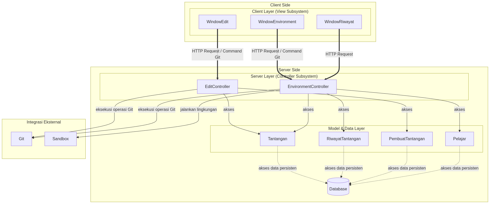
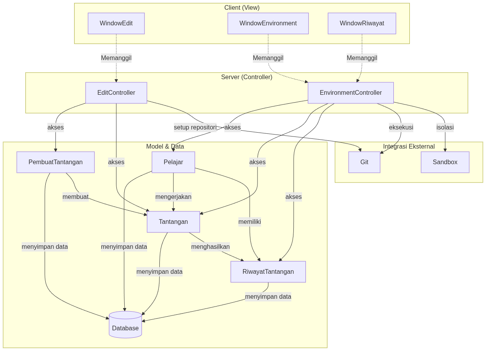

<h1>
IF2150 REKAYASA PERANGKAT LUNAK
 
TUGAS 6
 
ARSITEKTUR PERANGKAT LUNAK (APL)
</h1>
 

## *Commitment Issues*

### Untuk: *Made Branenda Jordhy*

Dipersiapkan oleh:

| Informasi | Keterangan |
| --- | --- |
| Kelas | 03 |
| Kelompok | 0x43 |

| NIM | Nama |
|---|---|
| 13525012 | Steve Bradley Hoeij |
| 13525072 | Fahrezy Fitriansyah |
| 13525084 | Ariq Ulwan Hammam |
| 13525132 | Zidane Uland Fakhry |
| 13525135 | Ananda Aulia Nurramadhan |
| 10124063 | Dominick Vincent Devict |
---

---

 
 

# BAB 1: Style/Pattern Arsitektur Acuan

<i>Gambar 1. Contoh Arsitektur MVC</i>

Untuk P/L ini, dipilih style/pattern **Client-Server**. Style/pattern ini dipilih karena perangkat lunak ini berbasis web yang didesain digunakan banyak pengguna yang dapat saling berinteraksi, melalui pembuatan dan pengerjaan tantangan, secara sekaligus. Selain itu, proses penggunaan pelajar ataupun pembuat tantangan terbatas pada mengirimkan request berupa command Git (KF04 dan KF06) atau pembaharuan data tantangan (KF01 dan KF02) kepada server, sehingga style/pattern ini sangat cocok. 

Server bertanggung jawab untuk menjalankan setup tantangan, memproses command Git yang dikirim pengguna saat pengerjaan tantangan atau evaluasi tantangan, memeriksa validitas jawaban pelajar, memperbaharui riwayat pengerjaan, dan menyimpan perubahan tantangan.

Tabel 1.1. Lingkungan Operasi Perangkat Lunak
| Komponen | Spesifikasi |
| :--- | :--- |
| *OS Server* | NixOS 25.06 |
| *Server web* | Nginx |
| *Runtime & Backend* | NodeJS 24 LTS |
| *DBMS* | PostgreSQL 18 |
| *Git* | Git 2.54.0 |
| *Browser* | Mozilla Firefox 150+ |
| *OS* | Cross-platform (asalkan mendukung web-browser yang didukung) |

Perangkat Lunak yang digunakan mendukung style/pattern Client-Server. Nginx berperan sebagai server web yang menerima koneksi dari client dan meneruskan permintaan kepada aplikasi backend. NodeJS 24 LTS digunakan sebagai runtime untuk menjalankan server yang memproses input dari client dan mengoperasikan sistem.

PostgreSQL 18 digunakan sebagai DBMS untuk menyimpan data secara persisten. Data disimpan secara terpusat agar dapat digunakan oleh banyak client. Selain itu, Git 2.54.0 digunakan oleh server untuk menjalankan operasi Git yang berkaitan dengan proses pengerjaan maupun evaluasi tantangan. Pada sisi client, Mozilla Firefox 150+ dipilih sebagai web-browser client karena bersifat cross-platform.

---

# BAB 2: Identifikasi Komponen / Modul / Subsistem

Tabel 2.1. Identifikasi Komponen/Modul/Subsistem

| Nama Komponen/Modul/Subsistem | Jenis                 | Penjelasan                                                                                                           |
| :---------------------------- | :-------------------- | :------------------------------------------------------------------------------------------------------------------- |
| *WindowEdit*                  | *Client*              | *Menyediakan antarmuka untuk membuat, mengubah, dan mengunggah berkas tantangan bagi PembuatTantangan.* |
| *WindowEnvironment*           | *Client*              | *Menyediakan antarmuka lingkungan pengerjaan dan pengujian tantangan sehingga pengguna dapat mengerjakan tantangan atau menguji tantangan.* |
| *WindowRiwayat*               | *Client*              | *Menampilkan riwayat pengerjaan, hasil, nilai, dan status kelulusan tantangan kepada Pelajar atau PembuatTantangan.* |
| *EditController*              | *Server*              | *Menangani proses dari WindowEdit, yaitu menerima unggahan berkas tantangan, memproses data tantangan, meenjalankan proses setup, dan menyimpan informasi tantangan.* |
| *EnvironmentController*       | *Server*              | *Menangani proses eksekusi lingkungan tantangan, melakukan verifikasi kondisi repositori, serta memproses hasil pengerjaan pengguna.* |
| *PembuatTantangan*            | *Model*               | *Merepresentasikan data dan informasi Pembuat Tantangan yang menggunakan sistem unukt membuat, menguji, mengelola, dan memantau hasil tantangan.* |
| *Pelajar*                     | *Model*               | *Merepresentasikan data dan infromasi Pelajar yang menggunakan sistem untuk memilih, mengerjakan, mengirimkan hasil, dan melihat riwayat tantangan.* |
| *Tantangan*                   | *Model*               | *Merepresentasikan data sebuah tantangan, seperti judul, deskripsi, aturan pengerjaan, berkas repositori, serta arsip yang diperlukan untuk proses setup, pengujian, dan verifikasi.* |
| *RiwayatTantangan*            | *Model*               | *Menyimpan dan merepresentasikan hasil pengerjaan tantangan, termasuk riwayat percobaan, hasil pengumpulan, nilai, dan status kelulusan Pelajar.* |
| *Database*                    | *Data*                | *Menyimpan data persisten sistem, seperti biodata pengguna, informasi tantangan, riwayat pengerjaan, hasil percobaan, nilai, dan status kelulusan.* |
| *Git*                         | *Integrasi Eksternal* | *Menyediakan mekanisme pengelolaan repositori dan eksekusi perintah Git yang digunakan dalam proses pengujian dan pengerjaan tantangan.* |
| *Sandbox*                     | *Integrasi Eksternal* | *Menyediakan lingkungan terisolasi di sisi server untuk menyimpan dan menjalankan repositori tantangan sehingga repositori simulasi tidak disimpan pada perangkat pengguna dan proses eksekusi dapat dibatasi.* |

---

# BAB 3: Model Arsitektur Perangkat Lunak

## 3.1 Logical View

Logical view digunakan untuk menggambarkan struktur logis perangkat lunak ini. View ini dipilih karena dapat memperlihatkan pemisahan tanggung jawab antara sisi client dan server.

<i>Gambar 2. Logical View Sistem</i>

---

# Referensi

- Sommerville, I. (2016). *Software Engineering* (10th ed.). Pearson. Chapter 6: *Architectural Design*: [https://software-engineering-book.com/slides/](https://software-engineering-book.com/slides/)
- Diagram arsitektur: [https://www.drawio.com/](https://www.drawio.com/), [https://staruml.io/](https://staruml.io/)
