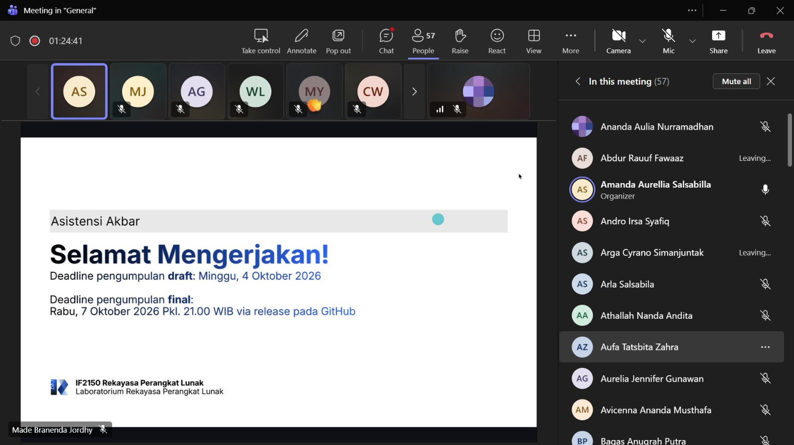

# Form Asistensi

## Tugas Besar IF2150 - Rekayasa Perangkat Lunak

| Informasi | Keterangan |
| --- | --- |
| **Hari** | - |
| **Tanggal** | - |
| **Kelas** | 03 |
| **Nomor Kelompok** | 03 |
| **Nama Kelompok** | 0x43 |
| **Nama Perangkat Lunak** | Commitment Issues  |
| **Dokumen** | K03_G03_APL.md |

### Anggota Kelompok

| NIM | Nama |
| --- | --- |
| 13525012 | Steve Bradley Hoeij |
| 13525072 | Fahrezy Fitriansyah |
| 13525084 | Ariq Ulwan Hammam |
| 13525132 | Zidane Uland Fakhry |
| 13525135 | Ananda Aulia Nurramadhan |
| 10124063 | Dominick Vincent Devict |

### Catatan

| Catatan |
| --- |
| 1. _Architectural style_ yang dapat dipilih mencakup MVC (_Model-View-Controller_), _layered architecture_, _client server architecture_, _repository architecture_, dan _pipe and filter architecture_. |
| 2. _Architectural view_ yang dapat digunakan mencakup _logical view_, _process view_, _physical view_, dan _development view_. |

## Dokumentasi

<!--  -->

  

  <i>Gambar 1. Dokumentasi kegiatan asistensi.</i>

